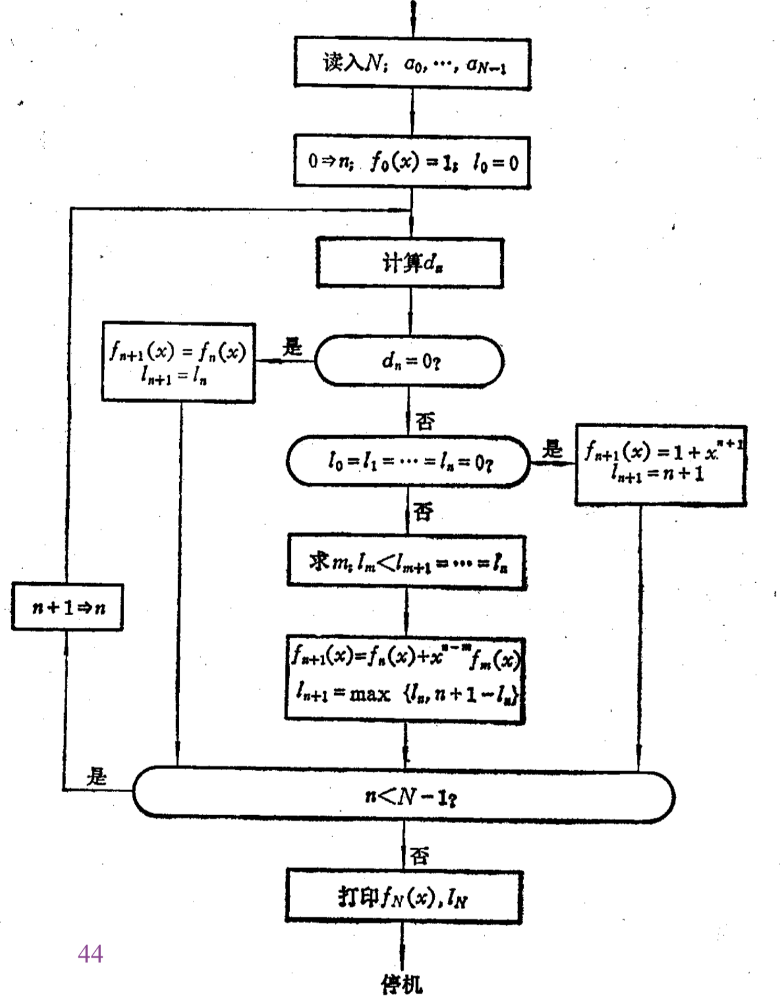

# BM

2017080084 张李牛牛 计71

## 问题

找出生成0 0 1 0 1 0 1 0 0 1 0 0 0 1的最短线性反馈移位寄存器

## 原理

课件中的算法过程

## 迭代步骤

Initial
$$
f_0(x) = 1, l_0 = 0 =>c_0 = 1
$$

$$
d_0 = 1*0 = 0 => f_1(x) = f_1(x) = c_0 = 1 \\ l_1 = l_0 = 0\\
d_1 = 1*0 = 0 => f_2(x) = f_1(x) = c_0 = 1 \\ l_2 = l_1 = 0\\
d_2 = 1*1 = 1 \and l_2 = l_1 = l_0 = 0 => f_3(x) = 1 + x^3 \\ l_3 = 3
$$

Step 1
$$
d_3 = 0*1 + 1*0 + 0*0 + 0*1 = 0 => f_4(x) = f_3(x) = 1 + x^3 \\ l_4 = l_3 = 3
$$
Step 2
$$
d_4 = 1*1 + 0*0 + 1*0 + 0*1 = 1\\
m = 2 \ s.t.\ l_m < l_{m+1} = l_{m+2} = ... = l_4\\
=> f_5(x) = (1+x^3)+x^{2}, l_5 = max\{l_4,5-l_4\} = 3
$$
Step 3
$$
d_5 = 1*0 + 0*1 + 1*0 + 1 * 1 = 1\\
m = 2 \ s.t.\ l_m < l_{m+1} = l_{m+2} = ... = l_5\\
=> f_6(x) = 1 + x^2 + x^3 + x^3 = 1+x^2, l_6 = max\{l_5,6-l_5\} = 3
$$
Step 4
$$
d_6 = 1*1+0*0+1*1 +0*0 = 2 = 0\\
f_7(x) = f_6(x) = 1+x^2,l_7 = l_6 = 3
$$
Step 5
$$
d_7 = 0*1 + 1*0 +0*1+1*0= 0\\
f_8(x) = f_7(x) = 1+x^2,l_8=l_7=3
$$
Step 6
$$
d_8=0*1+0*0+1*1+0*0=1\\
m = 2 \ s.t.\ l_m < l_{m+1} = l_{m+2} = ... = l_8\\
f_9(x) = 1+x^2+x^6,l_9 = max\{l_8,9-l_8\} = 6
$$
Step 7
$$
d_9 =1*1+0*0+0*1+1*0+0*0+1*0+1*0=1\\
m = 8 \ s.t.\ l_m < l_{m+1} = l_{m+2} = ... = l_9\\
f_{10}(x) = 1+x^2+x^6+x^1(1+x^2) = 1+x^1+x^2+x^3+x^6,l_{10}=max\{l_9,10-l_9\} = 6
$$
Step 8
$$
d_{10} = 0*1+1*1+0*1+0*1+1*0+0*0+1*1 = 2 = 0\\
f_{11}(x)= f_{10}(x)=1+x^1+x^2+x^3+x^6,l_{11}=l_{10}=6
$$
Step 9
$$
d_{11}=0*1+0*1+1*1+0*1+0*0+1*0+0*1=1\\
m = 8 \ s.t.\ l_m < l_{m+1} = l_{m+2} = ... = l_{11}\\
f_{12}=1+x^1+x^2+x^3+x^6+x^3(1+x^2) = 1+x^1+x^2+x^5+x^6,l_{12}=max\{l_{11},12-l_{11}\} = 6
$$
Step 10
$$
d_{12} = 1*0 + 1*0 + 1*0 + 0*1 + 0*0 + 1*0 + 1*1 = 1
m = 8 \ s.t.\ l_m < l_{m+1} = l_{m+2} = ... = l_{12}\\
f_{13}(x)=1+x^1+x^2+x^5+x^6+x^4(1+x^2) = 1+x^1+x^2+x^4+x^5,l_{13}=max\{l_{12},13-l_{12}\} = 7
$$
Step 11
$$
d_{13}=1*1 + 1*0 + 1*0 + 0*0 + 1*1 + 1*0 + 0*0 + 0*1 = 0\\
f_{14}(x) = f_{13}(x)=1+x^1+x^2+x^4+x^5,l_{14} = l_{13} = 7
$$

## 结果

$$
f(x) = f_{14}(x) = 1+x^1+x^2+x^4+x^5
$$

这表明<f(x),7>是所给序列一个周期的最短线性移位寄存器

