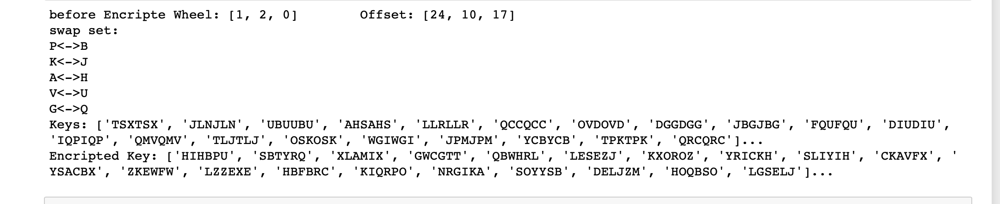
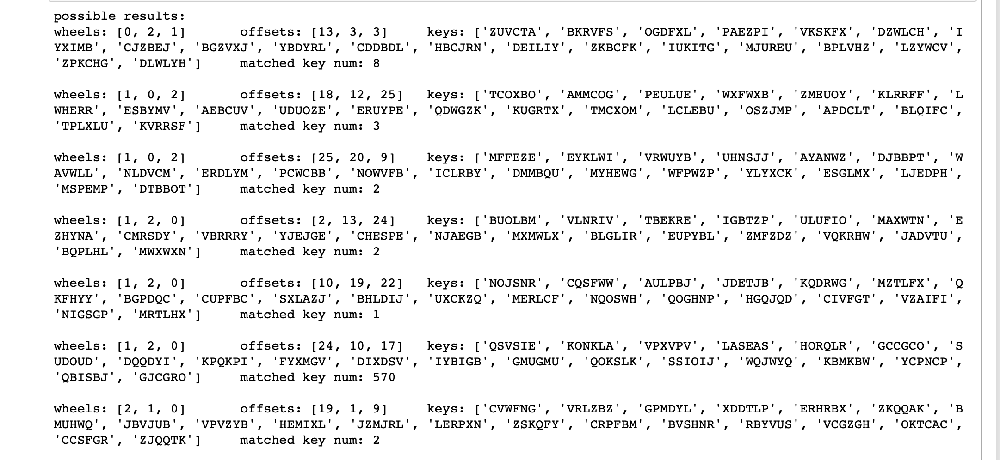

# Report

2017080084 张李牛牛

## Enigma

代码都在`XXX.ipynb`中，运行结果我额外导出到了`XXX.md`中

### Poland

波兰人方法我尝试先遍历各个状态生成了一个状态查询表，之后根据一组初始日秘钥加密一组如同`XYZXYZ`的秘钥，然后根据这些秘钥的循环节查询前面的表，获得一个远小于enigma状态集的子集，对这些子集进行遍历即可得到所求日秘钥。运行结果部分截图如下

生成测试



破解结果



由于波兰方法插线板并不复杂，因此不单独实现破解，取使秘钥破解成功次数最多的结果然后人工输入测例恢复插线板就可以了。

### Turing

祖师爷的办法相对于波兰人的方法要稍微复杂些，首先我们需要在明密文中找循环节，同时应注意由于在同一个状态下恩格玛密码机的加密具有自反性，因此不应只考虑从明文到密文的映射，也应考虑从密文到明文的映射。为了方便说明，下面分为几步：


1. 循环明密文构造映射三元组，例如在位置`i`上有`a->b`的映射则定义三元组`(a,b,i)`实际的实现中我采取了`a->(b,i)`

2. 根据前一步的到的映射进行遍历得到循环集

   

3. 对秘钥进行遍历，查找秘钥，秘钥应能够满足所有的循环节

   

   在这一步中我发现如果明密文长度不够长会导致循环节数量少，致使查找到的秘钥状态过多，一个例子是在循环节较少时我层得到了过万的结果

   

4. 最后根据秘钥进行加解密，并尝试破解插线板。

   这里为了方便演示我将上一步的结果设为了输入。接着遍历以字母为表示的循环节，在查找到的状态中应当能够满足这些循环节，因此再次遍历进行循环节有无插线板的匹配，之后再遍历明密文找出不匹配的地方尝试通弄简单的程序推导得出可能的插线板结果。下面的结果破解不完全是因为密文较短，但是破解后剩下的未知交换对人工可轻松破解。

   

   其中倒数第二行是输出为插线板函数，倒数第一行为推断中较不可能为交换对的字母。

## 1.5

人工查看暴力破解的结果，最后得出

```bash
offset 10
result: LOOKUPINTHEAIRITSABIRDITSAPLANEITSSUPERMAN
```

其中代码：

```python
inW	= ["A","B","C","D","E","F","G","H","I","J","K","L","M","N","O","P","Q","R","S","T","U","V","W","X","Y","Z"]
inC = {}
for i in range(len(inW)):
	inC[inW[i]] = i
secure = "BEEAKFYDJXUQYHYJIQRYHTYJIQFBQDUYJIIKFUHCQD"
scureToNum = []
for a in secure:
	scureToNum.append(inC[a])
for i in range(26):
	print("offset %s"%(i))
	testStr = ""
	for j in scureToNum:
		testStr = testStr+inW[(j+i)%26]
	print("result: %s"%(testStr))
```

## 1.16

对π可得

| x      | 1    | 2    | 3    | 4    | 5    | 6    | 7    | 8    |
| ------ | ---- | ---- | ---- | ---- | ---- | ---- | ---- | ---- |
| π_{-1} | 2    | 4    | 6    | 1    | 8    | 3    | 5    | 7    |

解密得

```bash
GENTLEMENDONOTREADEACHOTHERSMAIL
```

代码：

```python
inW	= ["A","B","C","D","E","F","G","H","I","J","K","L","M","N","O","P","Q","R","S","T","U","V","W","X","Y","Z"]
inC = {}
pi = [4,1,6,2,7,3,8,5]
for i in range(len(pi)):
	pi[i]-=1
print(pi)
back = {}
for i in range(len(pi)):
	back[pi[i]] = i
for i in range(len(inW)):
	inC[inW[i]] = i
cipher = "TGEEMNELNNTDROEOAAHDOETCSHAEIRLM"
code = list(cipher)
for i in range(int(len(cipher)/8)):
	for j in range(8):
		code[i*8+j] = cipher[i*8+back[j]]
print(('').join(code))
```

## 1.21

### a

对原文进行统计后得到如下结果

```bash
[('C', 0.14453125), ('G', 0.09375), ('S', 0.078125), ('K', 0.0703125), ('I', 0.05859375), ('Y', 0.05859375), ('U', 0.0546875), ('N', 0.05078125), ('Z', 0.05078125), ('E', 0.046875), ('O', 0.0390625), ('F', 0.03515625), ('D', 0.03125), ('J', 0.02734375), ('L', 0.02734375), ('X', 0.02734375), ('P', 0.0234375), ('A', 0.01953125), ('H', 0.01953125), ('M', 0.01953125), ('W', 0.01953125), ('Q', 0.00390625), ('B', 0), ('R', 0), ('T', 0), ('V', 0)]
```

对解密函数，不妨猜测有`C->E`，由提示我们又知道`F->W`。因此局部解密后得到

EMGLOSUDeGDNeUSWYSwHNSweYKDPUMLWGYIeOXYSIPJeKQPKUGKMGOLIeGINeGAeKSNISAeYKZSeKXEeJeKSHYSXeGOIDPKZeNKSHIeGIWYGKKGKGOLDSILKGOIUSIGLEDSPWZUGwZeeNDGYYSwUSZeNXEOJNeGYEOWEUPXEZGAeGNwGLKNSAeIGOIYeKXeJUeIUZewZeeNDGYYSwEUEKUZeSOewZeeNeIAeZEJNeSHwZEJZEGMXeYHeJUMGKUeY

（为方便标识我们将解密后的部分用小写标识）

自习观察局部解密结果，发现ZeeN经常出现，继续观察发现wZeeN为一个闭频繁项，不妨猜测这是一个单词`Wheel`，即存在映射`Z->H`与`N->L`。替换后得到如下结果：

EMGLOSUDeGDleUSWYSwHlSweYKDPUMLWGYIeOXYSIPJeKQPKUGKMGOLIeGIleGAeKSlISAeYKhSeKXEeJeKSHYSXeGOIDP**Khel**KSHIeGIWYGKKGKGOLDSILKGOIUSIGLEDSPWhUGwheelDGYYSwU**She**lXEOJleGYEOWEUPXEhGAeGlwGLKlSAeIGOIYeKXeJUeI**Uhe**wheelDGYYSwEUEK**Uhe**SOewheeleIAehEJleSHwhEJhEGMXeYHeJUMGKUeY

接下来不妨尝试寻找`The`，考虑到Uhe出现此处最频繁，猜测`U->T`，替换后得到如下结果：

EMGLOStDeGDletSWYSwHlSweYKDPtMLWGYIeOXYSIPJeKQPKtGKMGOLIeGIleGAeKSlISAeYKhSeKXEeJeKSHYSXeGOIDPKhelKSHIeGIWYGKKGKGOLDSILKGOItSIGLEDSPWhtGwheelDGYYSwtShelXEOJleGYEOWEtPXEhGAeGlwGLKlSAeIGOIYeKXeJteIthewheelDGYYSwEtEK**theSOewheel**eIAehEJleSHwhEJhEGMXeYHeJtMGKteY

发现**theSOewheel**推测可能中间的SOe是one，代入`S->O`&`O->N`：

EMGLnotDeGDletoWYowHloweYKDPtMLWGYIenXYoIPJeKQPKtGKMGnLIeGIleGAeKolIoAeYKhoeKXEeJeKoHYoXeGnIDPKhelKoHIeGIWYGKKGKGnLDoILKGnItoIGLEDoPWhtGwheelDGYYowtohelXEnJleGYEnWEtPXEhGAeGlwGLKloAeIGnIYeKXeJteIthewheelDGYYowEtEKtheonewheeleIAehEJleoHwhEJhEGMXeYHeJtMGKteY

发现`Yow`出现频率较高，推测可能是`row`，将`Y->R`代入：

EMGLnotDeGDletoW**rowHlower**KDPtMLWGrIenXroIPJeKQPKtGKMGnLIeGIleGAeKolIoAerKhoeKXEeJeKoHroXeGnIDPKhelKoHIeGIWrGKKGKGnLDoILKGnItoIGLEDoPWhtGwheelDGrrowtohelXEnJleGrEnWEtPXEhGAeGlwGLKloAeIGnIreKXeJteIthewheelDGrrowEtEKtheonewheeleIAehEJleoHwhEJhEGMXerHeJtMGKter

发现`rowHlower`推测中间可能是A，但替换后发现有子段`Jleoawh`，难以找出匹配的`J`，因此再次猜测可能是F，替换后得到：

EMGLnotDeGDle**toWrowflower**KDPtMLWGrIenXroIPJeKQPKtGKMGnLIeGIleGAeKolIoAerKhoeKXEeJeKofroXeGnIDPKhelKofIeGIWrGKKGKGnLDoILKGnItoIGLEDoPWhtGwheelDGrrowtohelXEnJleGrEnWEtPXEhGAeGlwGLKloAeIGnIreKXeJteIthewheelDGrrowEtEKtheonewheeleIAehEJleofwhEJhEGMXerfeJtMGKter

再次观察，发现`toWrowflower`猜测中间的W可能是g，替换得到：

EMGLnotDeGDletogrowflowerKDPtMLgGrIenXroIPJeKQPKtGKMGnLIeGIleGAeKolIoAerKhoeKXEeJeKofroXeGnIDPKhelKofIeGIgrGKKGKGnLDoILKGnItoIGLEDoPghtGwheelD**Grrow**tohelXEnJleGrEngEtPXEhGAeGlwGLKloAeIGnIreKXeJteIthewheelD**Grrow**EtEKtheonewheeleIAehEJleofwhEJhEGMXerfeJtMGKter

发现`Grrow`出现了两次，推测r前面应该是元音字母，并且此时`E`&`O`已经被找出，`rrow`前面出现`U`&`I`的可能性不大，极有可能`G->A`，替换后得出：

EMaLnotDeaDletogrowflowerKDPtMLgarIenXroIPJeKQPKtaKManLIeaIleaAeKolIoAerKhoeKXEeJeKofroXeanIDPKhelKofIeaIgraKKaKanLDoILKanItoIaLEDoPghtawheelDarrowtohelXEnJlearEngEtPXEhaAealwaLKloAeIanIreKXeJteIthewheelDarrowEtEKtheonewheeleIAehEJleofwhEJhEaMXerfeJtMaKter

此时出现频率极高的E仍未被解密因此其有可能是元音，考虑到其经常出现在以一段未知串的首部，猜测其有可能是`I`，替换后得到：

**iMaLnot**DeaDletogrowflowerKDPtMLgarIenXroIPJeKQPKtaKManLIeaIleaAeKolIoAerKhoeKXieJeKofroXeanIDPKhelKofIeaIgraKKaKanLDoILKanItoIaLiDoPghtawheelDarrowtohelXinJlearingitPXihaAealwaLKloAeIanIreKXeJteIthewheelDarrowitiKtheonewheeleIAehiJleofwhiJhiaMXerfeJtMaKter

发现首部的**iMaLnot**，猜测可能是`I may not`，代入`M->m`&`L->y`得到：

i may not DeaDle to grow flower KDPt my **garIen** XroIPJeKQPKtaKmanyIeaIleaAeKolIoAerKhoeKXieJeKofroXeanIDPKhelKofIeaIgraKKaKanyDoIyKanItoIayiDoPghtawheelDarrowtohelXinJlearingitPXihaAealwayKloAeIanIreKXeJteIthewheelDarrowitiKtheonewheeleIAehiJleofwhiJhiamXerfeJtmaKter

从句首开始做整理，发现**garIen**，根据flower推测有可能是garden，代入`I->D`，有：

i may not DeaDle to grow flower KDPt my garden XrodPJeKQPKtaK many dead **leaAeK** old oAerKhoeKXieJeKofroXeandDPKhelKofdeadgraKKaKanyDodyKandtodayiDoPghtawheelDarrowtohelXinJlearingitPXihaAealwayKloAedandreKXeJtedthewheelDarrowitiKtheonewheeledAehiJleofwhiJhiamXerfeJtmaKter

找到**leaAeK**，推测前面可能是`leaf`/`leav`，由于已经拥有`H->F`因此此处应是`A->V`&`leaveK`，结合后面跟着的**old**，K大概率是S，代入：

imaynotDeaDletogrowflowersDPtmygardenXrodPJesQPstasmanydeadleavesoldovershoesXieJesofroXeandDPshelsofdeadgrassasanyDodysandtodayiDoPghtawheelDarrowtohelXinJlearingitPXihavealwayslovedandresXeJtedthewheelDarrowitistheonewheeledvehiJle **of whiJh i am XerfeJt master**

观察尾部 **of whiJh i am XerfeJt master**，推测`J->c`&`X->p`，代入得：

imaynotDeaDletogrowflowersDPtmygardenprodPcesQPstasmanydeadleavesoldovershoespiecesofropeandDPshelsofdeadgrassasanyDodysandtodayiDoPghta wheel **Darrow** to help in **clearing it Pp** i have always loved and respected the wheel **Darrow** it is the one wheeled vehicle of which i am perfect master

考虑到**Darrow**出现过两次因此其可能是一个单词`Barrow`，此外结合上下文推测`Pp`可能是`Up`：

i may not be able to grow flowers but my garden produces Qust as many dead leaves old overshoes pieces of rope and bushels of dead grass as anybodys and today i bought a wheel barrow to  help in clearing it up i have always loved and respected the wheel barrow it is the one wheeled vehicle of which i am perfect master

最后整理发现`Q->J`：

i may not be able to grow flowers but my garden produces just as many dead leaves old overshoes pieces of rope and bushels of dead grass as anybodys and today i bought a wheel barrow to  help in clearing it up i have always loved and respected the wheel barrow it is the one wheeled vehicle of which i am perfect master

### b

由弗里德曼试验分析频率得到

```bash
Daniels-MacBook-Pro:Security daniel$ python3 ./ex1_21b.py 
1: 0.040872 
2: 0.038462 0.047120 
3: 0.055942 0.048102 0.048263 
4: 0.037255 0.042742 0.037579 0.049053 
5: 0.042581 0.043020 0.032564 0.035278 0.042967 
6: 0.062657 0.083766 0.049351 0.064935 0.042857 0.073377 
7: 0.030612 0.044326 0.043440 0.040780 0.044326 0.044326 0.040780 
8: 0.033223 0.040650 0.033682 0.040650 0.039489 0.045296 0.040650 0.054588 
9: 0.051209 0.042674 0.064011 0.075391 0.040541 0.034535 0.043544 0.048048 0.042042 
```

得到秘钥长度应该为6，遍历寻找出现最多的字母：

代码：（为了方便计算引入numpy）

```python
import numpy as np

inW	= ["A","B","C","D","E","F","G","H","I","J","K","L","M","N","O","P","Q","R","S","T","U","V","W","X","Y","Z"]
inC = {}
for i in range(len(inW)):
	inC[inW[i]] = i

string='KCCPKBGUFDPHQTYAVINRRTMVGRKDNBVFDETDGILTXRGUDDKOTFMBPVGEGLTGCKQRACQCWDNAWCRXIZAKFTLEWRPTYCQKYVXCHKFTPONCQQRHJVAJUWETMCMSPKQDYHJVDAHCTRLSVSKCGCZQQDZXGSFRLSWCWSJTBHAFSIASPRJAHKJRJUMVGKMITZHFPDISPZLVLGWTFPLKKEBDPGCEBSHCTJRWXBAFSPEZQNRWXCVYCGAONWDDKACKAWBBIKFTIOVKCGGHJVLNHIFFSQESVYCLACNVRWBBIREPBBVFEXOSCDYGZWPFDTKFQIYCWHJVLNHIQIBTKHJVNPIST'
def rate(stringTmp):
	p = np.zeros(26)
	for i in stringTmp:
		p[inC[i]] += 1
	return (p * (p-1)).sum() / (p.sum() * (p.sum() - 1))
for m in range(1, 10):
	print(m, end=': ')
	for i in range(m):
		print('%.6f' % rate(string[i::m]), end=' ')
```

这里我决定采取解密后字母数量分布与统计中一般分布的余弦相似度作为评估指数

引入余弦

```python
def cosine_distance(x,y):
	return 1 - np.dot(x,y)/(np.linalg.norm(x)*np.linalg.norm(y))
```

计算与结果`CRYPTO`

```python
for l in range(6):
	tmpStr = string[l::6]
	re = {}
	for j in range(26):
		st = [0]*26
		for i in tmpStr:
			st[(inC[i]-j)%26] +=1/len(tmpStr)
		# print(st)
		re[inW[j]] = cosine_distance(table,np.array(st))
	print(sorted(re.items(),key= lambda x : x[1])[0])

('C', 0.10569820013892817)
('R', 0.11141086876811312)
('Y', 0.10970658480633999)
('P', 0.10828873747778289)
('T', 0.1252583265465813)
('O', 0.07916724640432027)
```

### c

对字母出现次数进行统计，得到

```bash
[('C', 0.16161616161616169), ('B', 0.10606060606060609), ('K', 0.10101010101010104), ('P', 0.10101010101010104), ('I', 0.08080808080808081), ('E', 0.0707070707070707), ('A', 0.06565656565656565), ('R', 0.0606060606060606), ('D', 0.045454545454545456), ('F', 0.045454545454545456), ('J', 0.030303030303030307), ('U', 0.030303030303030307), ('Q', 0.020202020202020204), ('V', 0.020202020202020204), ('Z', 0.020202020202020204), ('O', 0.010101010101010102), ('X', 0.010101010101010102), ('H', 0.005050505050505051), ('N', 0.005050505050505051), ('S', 0.005050505050505051), ('Y', 0.005050505050505051), ('G', 0), ('L', 0), ('M', 0), ('T', 0), ('W', 0)]
```

由于`C`与`B`出现次数最多，猜测他们分别是`E`与`T`，得到
$$
明文 = （密文\times11+6）\mod{26}
$$
得到

`OCANADATERREDENOSAIEUXTONFRONTESTCEINTDEFAEURONSGLORIEUXCARTONBRASSAITPORTERLEPEEILSAITPORTERLACROIXTONHISTOIREESTUNEEPOPEEDESPLUSBRILLANTSEXPLOITSETTAVALEURDEFOITREMPEEPROTEGERANOSFOYERSETNOSDROITS`

可以发现这是加拿大国歌

### d

从词频的角度统计发现者不是直接置换，因此推测其可能为维吉尼亚密码

```bash
1: 0.041613 
2: 0.044333 0.046382 
3: 0.044645 0.048125 0.048387 
4: 0.043468 0.057504 0.046517 0.047452 
5: 0.045045 0.042523 0.041441 0.044058 0.037023 
6: 0.051203 0.063458 0.054997 0.069804 0.055526 0.069804 
7: 0.040531 0.044724 0.044267 0.037736 0.046444 0.031930 0.046444 
8: 0.058279 0.059204 0.050879 0.048104 0.037928 0.064734 0.046377 0.050242 
9: 0.048780 0.045296 0.041812 0.036005 0.040244 0.040244 0.042683 0.045122 0.062195 
```

推测密码长度可能还是6，直接运行第二题代码得到秘钥`THEORY`

```
('T', 0.07882446584169389)
('H', 0.030807308815837042)
('E', 0.11536191462320844)
('O', 0.0853826839611469)
('R', 0.07706798339300147)
('Y', 0.14216761206935913)
```

## 1.26

### a

将M与N进行互换，然后对密文再加密一次即可

代码如下

```bash
def decode(s,m,n):
	r = ""
	for k in range(0,len(s),m*n):
		for i in range(n):
			for j in range(m):
				r = r+s[k+j*n+i]
	return r

print(decode("ctaropyghpry",4,3))
# cryptography
```

经过不断的尝试后得到

```python
s='myamraruyiqtenctorahroywdsoyeouarrgdernogw'
print(decode(s, 3, 2))
# marymaryquitecontraryhowdoesyourgardengrow
```

